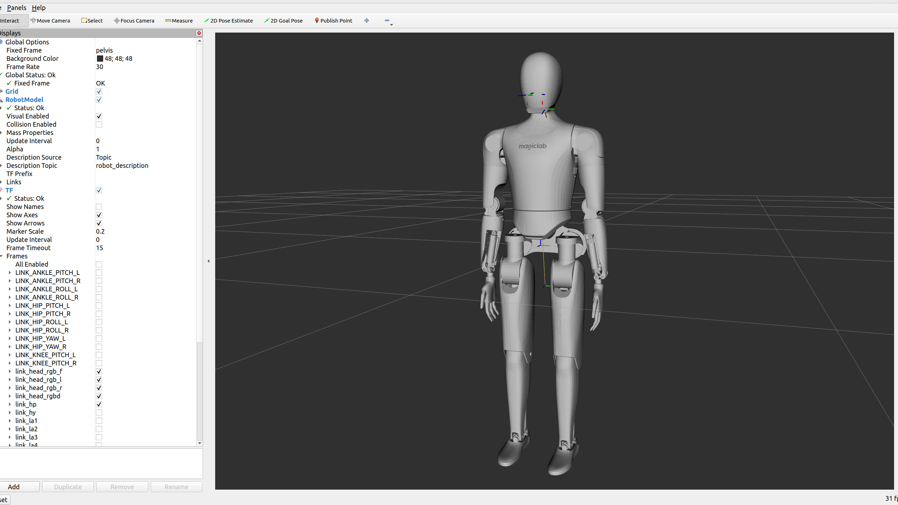
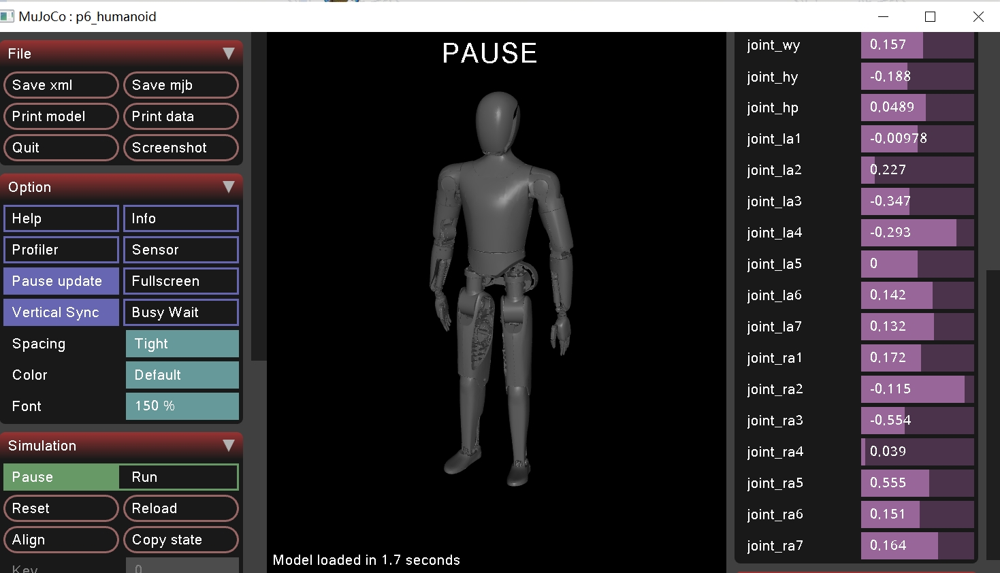

# Magicbot-Gen1 Description (URDF & MJCF)

## Overview

This package includes a universal humanoid robot description (URDF & MJCF) for the [Magicbot-Gen1](https://www.magiclab.top/human), developed by Magiclab Robotics.

<table>
  <tr>
    <td></td>
    <td></td>
  </tr>
</table>

Magicbot-Gen1 Humanoid have 30 joints:

```text
root [⚓] => /pelvis/
    JOINT_HIP_ROLL_L [⚙+X] => /LINK_HIP_ROLL_L/
        JOINT_HIP_YAW_L [⚙+Z] => /LINK_HIP_YAW_L/
            JOINT_HIP_PITCH_L [⚙+Y] => /LINK_HIP_PITCH_L/
                JOINT_KNEE_PITCH_L [⚙+Y] => /LINK_KNEE_PITCH_L/
                    JOINT_ANKLE_PITCH_L [⚙+Y] => /LINK_ANKLE_PITCH_L/
                        JOINT_ANKLE_ROLL_L [⚙+X] => /LINK_ANKLE_ROLL_L/
    JOINT_HIP_ROLL_R [⚙+X] => /LINK_HIP_ROLL_R/
        JOINT_HIP_YAW_R [⚙+Z] => /LINK_HIP_YAW_R/
            JOINT_HIP_PITCH_R [⚙+Y] => /LINK_HIP_PITCH_R/
                JOINT_KNEE_PITCH_R [⚙+Y] => /LINK_KNEE_PITCH_R/
                    JOINT_ANKLE_PITCH_R [⚙+Y] => /LINK_ANKLE_PITCH_R/
                        JOINT_ANKLE_ROLL_R [⚙+X] => /LINK_ANKLE_ROLL_R/
    joint_wr [⚙+X] => /LINK_WR/
        joint_wy [⚙+Z] => /LINK_WY/
            joint_hy [⚙+Z] => /LINK_HY/
                joint_hp [⚙+Y] => /LINK_HP/
                    joint_la1 [⚙+Y] => /LINK_LA1/
                        joint_la2 [⚙+X] => /LINK_LA2/
                            joint_la3 [⚙+Z] => /LINK_LA3/
                                joint_la4 [⚙+X] => /LINK_LA4/
                                    joint_la5 [⚙+Z] => /LINK_LA5/
                                        joint_la6 [⚙+X] => /LINK_LA6/
                                            joint_la7 [⚙+Y] => /LINK_LA7/
                    joint_ra1 [⚙+Y] => /LINK_RA1/
                        joint_ra2 [⚙+X] => /LINK_RA2/
                            joint_ra3 [⚙+Z] => /LINK_RA3/
                                joint_ra4 [⚙+X] => /LINK_RA4/
                                    joint_ra5 [⚙+Z] => /LINK_RA5/
                                        joint_ra6 [⚙+X] => /LINK_RA6/
                                            joint_ra7 [⚙+Y] => /LINK_RA7/
```
